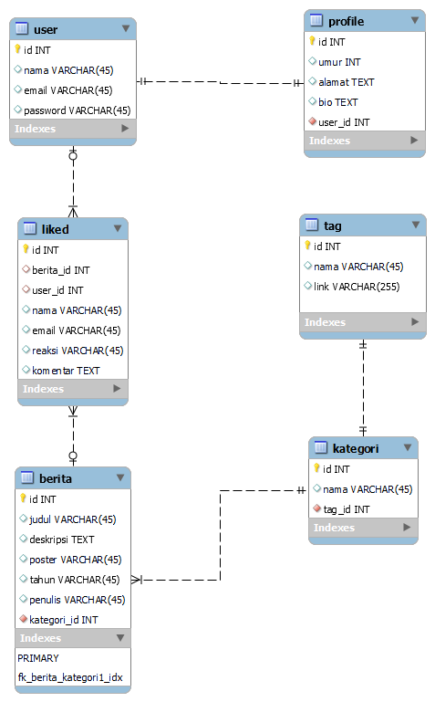

<h1>Final Project</h1>
<h2>Kelompok 7</h2>
<h2>Anggota Kelompok</h2>
<ul>
    <li>Fitriono Arya Riski</li>
    <li>Tentrie Yukementhari</li>
    <li>Reza Nur Ridwan</li>
</ul>

<h2>Tema Project</h2>

Posting Berita

<h2>ERD</h2>

Link Demo Aplikasi : https://drive.google.com/file/d/1QfnJKFVB4YntSFSVGlOVAFpAby6Epzwe/view?usp=sharing

Link Deploy : http://webnewsportal.herokuapp.com/

<h2>List Pekerjaan</h2>

Reza Nur Ridwan

<ol>
    <li>Membuat ERD bersama</li>
    <li>Membuat CRUD tabel berita</li>
    <li>Mencari dan menambahkan template untuk bagian home</li>
    <li>Menambahkan auth</li>
    <li>Membuat template auth register versi 1</li>
    <li>Membuat form register versi 1</li>
</ol>

Tentrie Yukementhari

<ol>
    <li>Membuat ERD bersama</li>
    <li>Menambahkan auth dan mengubah sedikit auth</li>
    <li>Membuat template auth register versi 2</li>
    <li>Membuat form register versi 2</li>
    <li>Menambahkan icon web</li>
</ol>

Fitriono Arya Riski

<ol>
    <li>Membuat ERD bersama</li>
    <li>Mengedit dan menambahkan CRUD yang sudah dibuat tim</li>
    <li>Mengedit auth yang sudah dibuat tim</li>
    <li>Memperbaiki tampilan home dan dashboard</li>
    <li>Menampilkan data dari database ke layout</li>
    <li>Membuat fitur komentar</li>
</ol>
